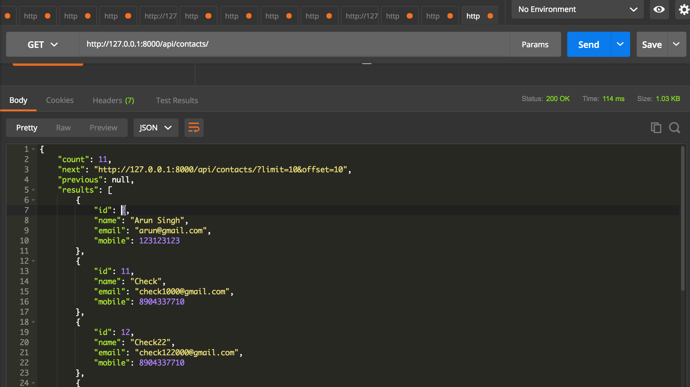
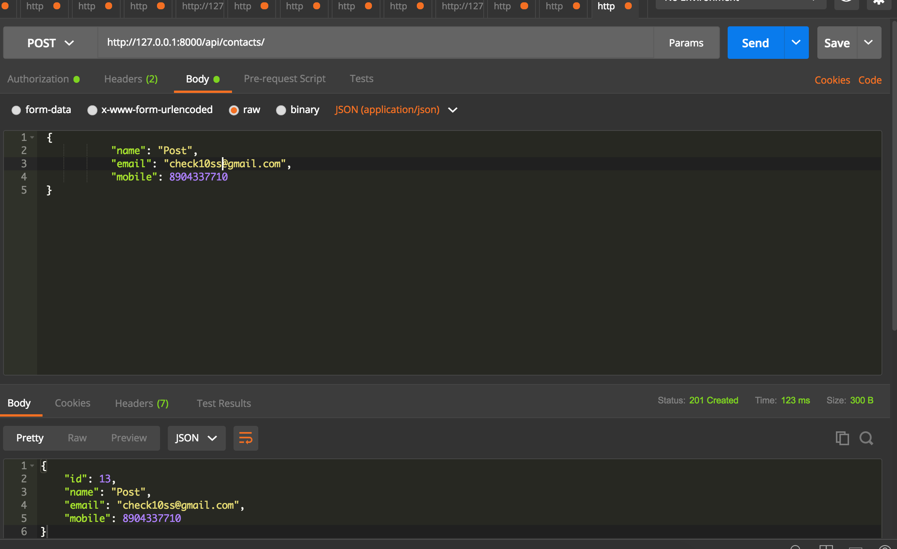
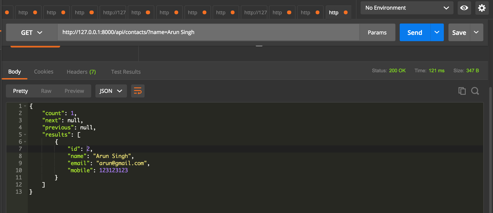
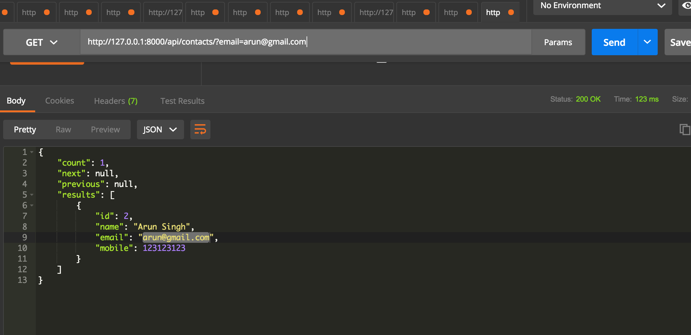
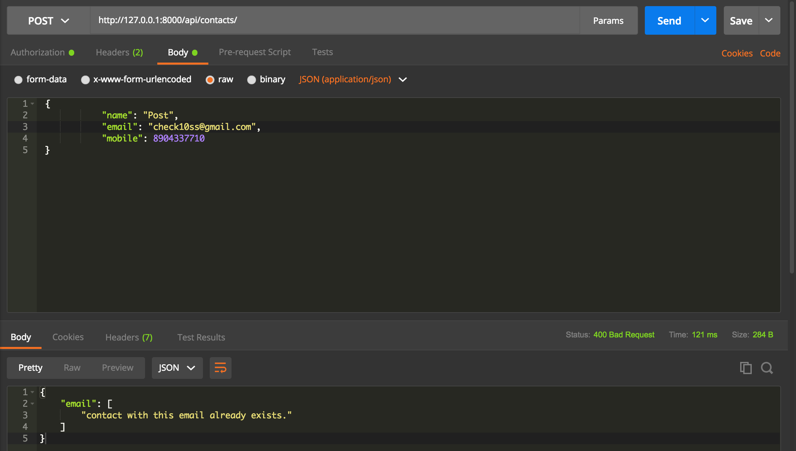
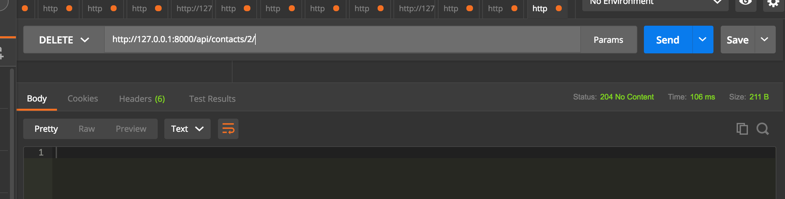
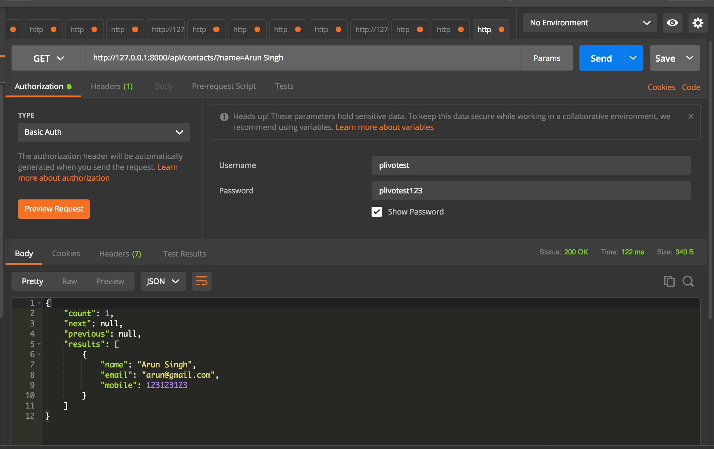

#PLIVO Assignment

## This is a sample app for contact api's high scale

### Run the project 
```
python3 manage.py migrate
python3 manage.py testserver
```
### OR Buid using Docker image
Using Docker file
```
docker build -t django-to_do_app .
docker run --name=Django -td django-to_do_app
```

## Specs and feature

1. GET ALL



2.  POST


3. Search by name


4. Search by email


5. Email unique index


6. Delete


7. Search by email


8. Basic Auth


